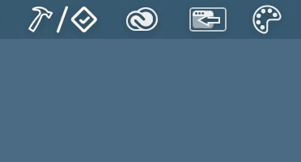
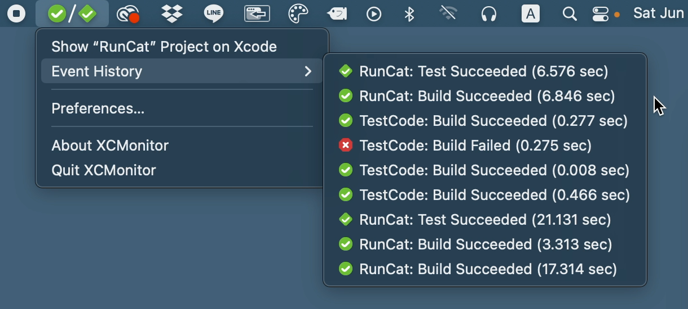
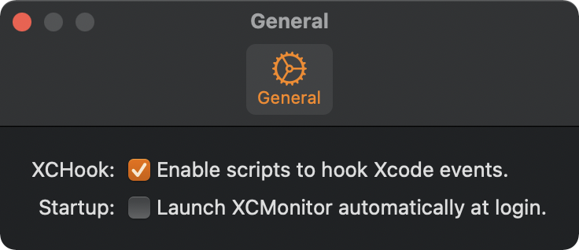

# XCMonitor

A simple tool to monitor Xcode events (building and testing).

## Logging event history

This app can collect Xcode event types and elapsed time.

## Installation

Go to [Releases](https://github.com/Kyome22/XCMonitor/releases) and download the latest `dmg` file.

## How to activate

Open Preferences of XCMonitor and enable XCHook.

